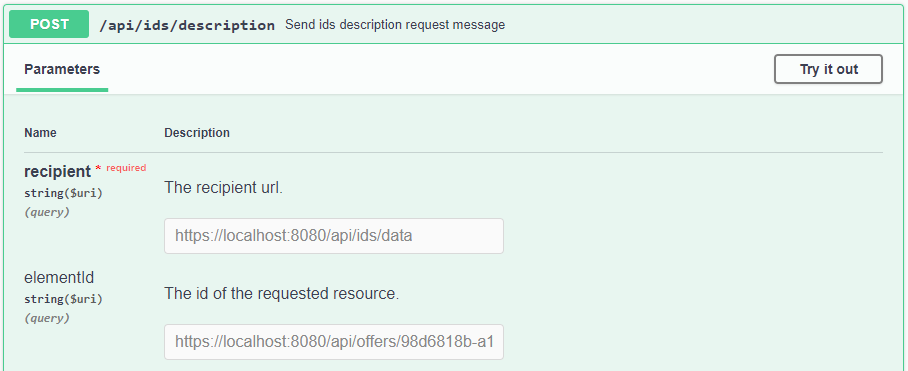
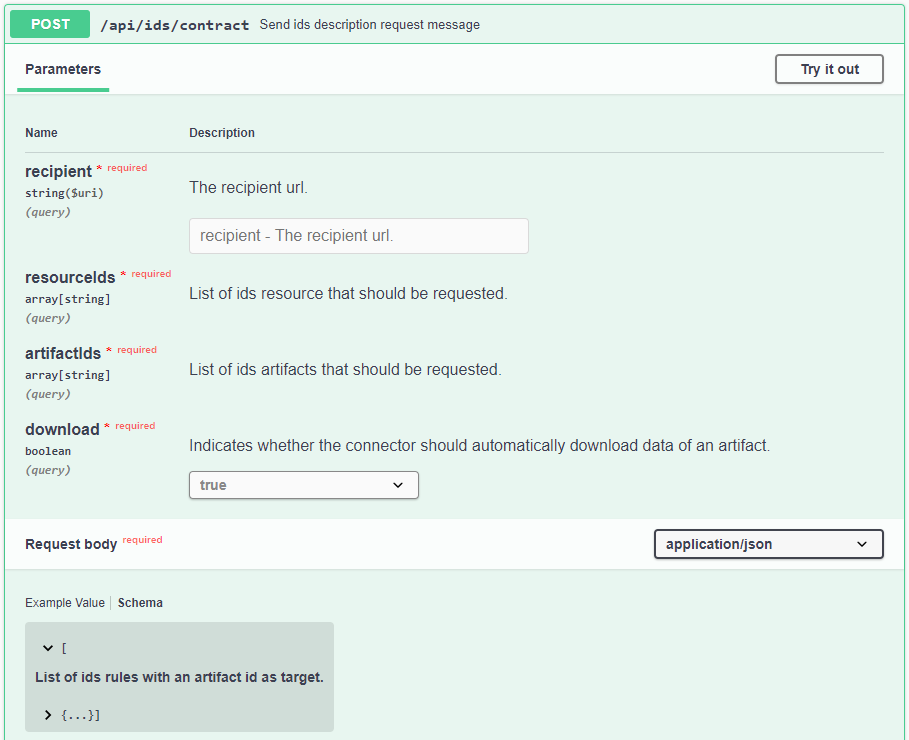
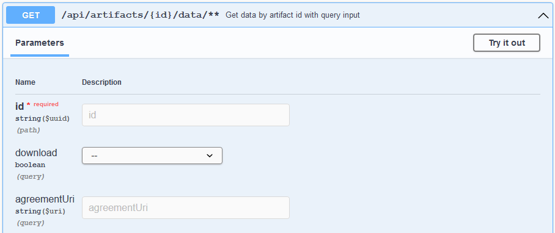

# Consuming Data
{: .fs-9 }

See how to consume data with the Dataspace Connector.
{: .fs-6 .fw-300 }

[previous version](../v5/consumer.md)

---

The connector provides an endpoint for requesting its self-description.
The self-description is returned as JSON-LD and contains several information about the running
connector instance. This includes e.g. the title, the maintainer, the IDS Infomodel version, and
the resource catalog. At the public endpoint `/`, the resource catalog is not displayed. It can only
be accessed with admin credentials at `GET /api/connector` or by sending an IDS description request
message as explained [here](pages/communication/v6/consumer.md#step-1-request-a-connectors-self-description)).


## Step by Step

For requesting data and metadata as a data consumer, two endpoints are provided. A description
request is used for requesting the metadata and a contract request is used for handling out
contract agreements as a condition to retrieve raw data from a data provider.


---

**Important**: Note that the `/api/ids/data` endpoint may not be valid for other connector
implementations. Check at which endpoint the data provider expects the IDS multipart messages in
advance.

---

### Step 1: Query Provider - Request a Connector's Self-description

For sending a `POST` request, two parameters have to be set: the recipient and the requested element.
As the data consumer needs to access the self-description of a data provider to know all resource
offers, the requested element should be empty.



If the request is successful, the response body will contain a `BaseConnector` with a single catalog
or list of catalogs.

````json
{
  "@context" : {
    "ids" : "https://w3id.org/idsa/core/",
    "idsc" : "https://w3id.org/idsa/code/"
  },
  "@type" : "ids:BaseConnector",
  "@id" : "https://w3id.org/idsa/autogen/baseConnector/7b934432-a85e-41c5-9f65-669219dde4ea",
  "ids:publicKey" : {
    "@type" : "ids:PublicKey",
    "@id" : "https://w3id.org/idsa/autogen/publicKey/78eb73a3-3a2a-4626-a0ff-631ab50a00f9",
    "ids:keyType" : {
      "@id" : "idsc:RSA"
    },
    "ids:keyValue" : "[...]"
  },
  "ids:version" : "5.0.0",
  "ids:description" : [ {
    "@value" : "IDS Connector with static example resources hosted by the Fraunhofer ISST",
    "@type" : "http://www.w3.org/2001/XMLSchema#string"
  } ],
  "ids:title" : [ {
    "@value" : "Dataspace Connector",
    "@type" : "http://www.w3.org/2001/XMLSchema#string"
  } ],
  "ids:securityProfile" : {
    "@id" : "idsc:BASE_SECURITY_PROFILE"
  },
  "ids:maintainer" : {
    "@id" : "https://www.isst.fraunhofer.de/"
  },
  "ids:resourceCatalog" : [ {
    "@type" : "ids:ResourceCatalog",
    "@id" : "https://localhost:8080/api/catalogs/eda0cda2-10f2-4b39-b462-5d4f2b1bb758"
  } ],
  "ids:curator" : {
    "@id" : "https://www.isst.fraunhofer.de/"
  },
  "ids:hasDefaultEndpoint" : {
    "@type" : "ids:ConnectorEndpoint",
    "@id" : "https://w3id.org/idsa/autogen/connectorEndpoint/e5e2ab04-633a-44b9-87d9-a097ae6da3cf",
    "ids:accessURL" : {
      "@id" : "https://localhost:8080/api/ids/data"
    }
  },
  "ids:inboundModelVersion" : [ "4.0.0", "4.0.4" ],
  "ids:outboundModelVersion" : "4.0.4"
}
````

### Step 2: Query Provider - Request Resource Metadata

To request the metadata of a specific catalog, resource, representation, artifact, or contract, use
the same description request endpoint and put the value of `@id` as requested element.

If your DAT within the `DescriptionRequestMessage` was not valid, the requested element could not be
found, or any other error occurred, you will receive a `RejectionMessage` with an according
rejection reason from the provider connector. E.g.:

````json
{
  "reason": {
    "properties": null,
    "@id": "idsc:NOT_FOUND"
  },
  "payload": "The requested element https://localhost:8080/api/catalogs/5ac012e1-ffa5-43b3-af41-9707d2a9137e could not be found.",
  "type": "de.fraunhofer.iais.eis.RejectionMessageImpl"
}
````

With this, you can navigate yourself through the data offers of the provider and choose the artifact
whose data you want to retrieve. A response will never contain the raw data.

Following the example data, that was provided within the [provider guide](pages/communication/v6/provider.md), we would end
up with the following information when requesting
[https://localhost:8080/api/catalogs/eda0cda2-10f2-4b39-b462-5d4f2b1bb758](https://localhost:8080/api/catalogs/eda0cda2-10f2-4b39-b462-5d4f2b1bb758)
and its resource offer [https://localhost:8080/api/offers/98d6818b-a1b7-4171-a318-a0e11837bf10](https://localhost:8080/api/offers/98d6818b-a1b7-4171-a318-a0e11837bf10):

````json
{
  "@context" : {
    "ids" : "https://w3id.org/idsa/core/",
    "idsc" : "https://w3id.org/idsa/code/"
  },
  "@type" : "ids:Resource",
  "@id" : "https://localhost:8080/api/offers/98d6818b-a1b7-4171-a318-a0e11837bf10",
  "ids:language" : [ {
    "@id" : "idsc:EN"
  } ],
  "ids:created" : {
    "@value" : "2021-05-17T18:58:39.351Z",
    "@type" : "http://www.w3.org/2001/XMLSchema#dateTimeStamp"
  },
  "ids:version" : "1",
  "ids:description" : [ {
    "@value" : "This is an example resource containing weather data.",
    "@language" : "EN"
  } ],
  "ids:title" : [ {
    "@value" : "Sample Resource",
    "@language" : "EN"
  } ],
  "ids:sovereign" : {
    "@id" : "https://openweathermap.org/"
  },
  "ids:publisher" : {
    "@id" : "https://openweathermap.org/"
  },
  "ids:representation" : [ {
    "@type" : "ids:Representation",
    "@id" : "https://localhost:8080/api/representations/53c05406-23b2-4ca1-8d39-063681944412",
    "ids:instance" : [ {
      "@type" : "ids:Artifact",
      "@id" : "https://localhost:8080/api/artifacts/9bb8162b-a754-43ed-a590-f50645bbf220",
      "ids:fileName" : "",
      "ids:creationDate" : {
        "@value" : "2021-05-17T18:58:39.534Z",
        "@type" : "http://www.w3.org/2001/XMLSchema#dateTimeStamp"
      },
      "ids:byteSize" : 0,
      "ids:checkSum" : "0"
    } ],
    "ids:language" : {
      "@id" : "idsc:EN"
    },
    "ids:created" : {
      "@value" : "2021-05-17T18:58:39.443Z",
      "@type" : "http://www.w3.org/2001/XMLSchema#dateTimeStamp"
    },
    "ids:mediaType" : {
      "@type" : "ids:IANAMediaType",
      "@id" : "https://w3id.org/idsa/autogen/iANAMediaType/b6dca6fa-842b-4144-ac26-2988c884d5e8",
      "ids:filenameExtension" : ""
    },
    "ids:modified" : {
      "@value" : "2021-05-17T18:58:39.443Z",
      "@type" : "http://www.w3.org/2001/XMLSchema#dateTimeStamp"
    },
    "ids:representationStandard" : {
      "@id" : ""
    }
  } ],
  "ids:resourceEndpoint" : [ {
    "@type" : "ids:ConnectorEndpoint",
    "@id" : "https://w3id.org/idsa/autogen/connectorEndpoint/da3f1e1c-1d3a-45cf-8683-93b8c090a601",
    "ids:endpointDocumentation" : [ {
      "@id" : "https://example.com"
    } ],
    "ids:accessURL" : {
      "@id" : "https://localhost:8080/api/offers/98d6818b-a1b7-4171-a318-a0e11837bf10"
    }
  } ],
  "ids:contractOffer" : [ {
    "@type" : "ids:ContractOffer",
    "@id" : "https://localhost:8080/api/contracts/94c31f67-aec9-43d4-a7ca-887cc1aaced1",
    "ids:permission" : [ {
      "@type" : "ids:Permission",
      "@id" : "https://localhost:8080/api/rules/c5d94d73-f3b1-4b4d-b003-0c2e91e221c0",
      "ids:description" : [ {
        "@value" : "provide-access",
        "@type" : "http://www.w3.org/2001/XMLSchema#string"
      } ],
      "ids:title" : [ {
        "@value" : "Example Usage Policy",
        "@type" : "http://www.w3.org/2001/XMLSchema#string"
      } ],
      "ids:action" : [ {
        "@id" : "idsc:USE"
      } ]
    } ],
    "ids:provider" : {
      "@id" : ""
    },
    "ids:consumer" : {
      "@id" : ""
    },
    "ids:contractEnd" : {
      "@value" : "2021-05-17T18:58:39.626Z",
      "@type" : "http://www.w3.org/2001/XMLSchema#dateTimeStamp"
    },
    "ids:obligation" : [ ],
    "ids:prohibition" : [ ],
    "ids:contractDate" : {
      "@value" : "2021-05-17T21:01:26.576+02:00",
      "@type" : "http://www.w3.org/2001/XMLSchema#dateTimeStamp"
    },
    "ids:contractStart" : {
      "@value" : "2021-05-17T18:58:39.626Z",
      "@type" : "http://www.w3.org/2001/XMLSchema#dateTimeStamp"
    }
  } ],
  "ids:keyword" : [ {
    "@value" : "weather",
    "@language" : "EN"
  }, {
    "@value" : "data",
    "@language" : "EN"
  }, {
    "@value" : "sample",
    "@language" : "EN"
  } ],
  "ids:standardLicense" : {
    "@id" : "http://opendatacommons.org/licenses/odbl/1.0/"
  },
  "ids:modified" : {
    "@value" : "2021-05-17T18:58:39.351Z",
    "@type" : "http://www.w3.org/2001/XMLSchema#dateTimeStamp"
  },
  "key" : "value"
}
````

### Step 3: Negotiate a Contract Agreement

As you are not allowed to retrieve data from a provider without a matching contract agreement, you
first have to initiate a contract negotiation. A single resource can contain multiple
representations, therefore, the data consumer needs to check all available artifacts in the
requested metadata and choose one for the data request.

Within the description response, you receive the resource's metadata containing a contract offer.
Use the provided endpoint to put the received contract offer's rule or a modified one in the request
body and start the contract negotiation for a specific artifact and resource. You will agree to the
provided contract offer by using it for the contract request without content changes. You just have
to add the artifact id as `ids:target` to the rule.

If you provide wrong inputs, you will get a response body with a hint on what went wrong.



With the `download` value you may specify whether you want the Dataspace Connector to download the
data immediately or later.

For our example, a correct request would look like that:

```
curl -X 'POST' \
  'https://localhost:8080/api/ids/contract?recipient=https%3A%2F%2Flocalhost%3A8080%2Fapi%2Fids%2Fdata&resourceIds=https%3A%2F%2Flocalhost%3A8080%2Fapi%2Foffers%2F98d6818b-a1b7-4171-a318-a0e11837bf10&artifactIds=https%3A%2F%2Flocalhost%3A8080%2Fapi%2Fartifacts%2F9bb8162b-a754-43ed-a590-f50645bbf220&download=true' \
  -H 'accept: */*' \
  -H 'Content-Type: application/json' \
  -d '[
 {
      "@type" : "ids:Permission",
      "@id" : "https://localhost:8080/api/rules/c5d94d73-f3b1-4b4d-b003-0c2e91e221c0",
      "ids:description" : [ {
        "@value" : "provide-access",
        "@type" : "http://www.w3.org/2001/XMLSchema#string"
      } ],
      "ids:title" : [ {
        "@value" : "Example Usage Policy",
        "@type" : "http://www.w3.org/2001/XMLSchema#string"
      } ],
      "ids:action" : [ {
        "@id" : "idsc:USE"
      } ],
      "ids:target": "https://localhost:8080/api/artifacts/9bb8162b-a754-43ed-a590-f50645bbf220"
    }
]'
```

The rule list will be automatically turned into a contract request to then send it to the provider.
This will read this contract request, compare it to the artifact's (respectively the corresponding
resource's) contract offers, and return either a `ContractRejectionMessage` or a
`ContractAgreementMessage`.

As a response, we now receive the closed contract agreement:

```json
{
  "creationDate": "2021-05-17T21:16:01.050+0200",
  "modificationDate": "2021-05-17T21:16:01.050+0200",
  "remoteId": "https://localhost:8080/api/agreements/fb45ebeb-55a8-4aa6-bdd3-3765b067db2b",
  "confirmed": true,
  "value": "{\r\n  \"@context\" : {\r\n    \"ids\" : \"https://w3id.org/idsa/core/\"\r\n  },\r\n  \"@type\" : \"ids:ContractAgreement\",\r\n  \"@id\" : \"https://localhost:8080/api/agreements/fb45ebeb-55a8-4aa6-bdd3-3765b067db2b\",\r\n  \"ids:permission\" : [ {\r\n    \"@type\" : \"ids:Permission\",\r\n    \"@id\" : \"https://localhost:8080/api/rules/c5d94d73-f3b1-4b4d-b003-0c2e91e221c0\",\r\n    \"ids:target\" : {\r\n      \"@id\" : \"https://localhost:8080/api/artifacts/9bb8162b-a754-43ed-a590-f50645bbf220\"\r\n    },\r\n    \"ids:description\" : [ {\r\n      \"@value\" : \"provide-access\",\r\n      \"@type\" : \"http://www.w3.org/2001/XMLSchema#string\"\r\n    } ],\r\n    \"ids:title\" : [ {\r\n      \"@value\" : \"Example Usage Policy\",\r\n      \"@type\" : \"http://www.w3.org/2001/XMLSchema#string\"\r\n    } ],\r\n    \"ids:assignee\" : [ {\r\n      \"@id\" : \"https://w3id.org/idsa/autogen/baseConnector/7b934432-a85e-41c5-9f65-669219dde4ea\"\r\n    } ],\r\n    \"ids:assigner\" : [ {\r\n      \"@id\" : \"https://w3id.org/idsa/autogen/baseConnector/7b934432-a85e-41c5-9f65-669219dde4ea\"\r\n    } ],\r\n    \"ids:action\" : [ {\r\n      \"@id\" : \"idsc:USE\"\r\n    } ]\r\n  } ],\r\n  \"ids:provider\" : {\r\n    \"@id\" : \"https://w3id.org/idsa/autogen/baseConnector/7b934432-a85e-41c5-9f65-669219dde4ea\"\r\n  },\r\n  \"ids:consumer\" : {\r\n    \"@id\" : \"https://w3id.org/idsa/autogen/baseConnector/7b934432-a85e-41c5-9f65-669219dde4ea\"\r\n  },\r\n  \"ids:obligation\" : [ ],\r\n  \"ids:prohibition\" : [ ],\r\n  \"ids:contractDate\" : {\r\n    \"@value\" : \"2021-05-17T21:16:00.849+02:00\",\r\n    \"@type\" : \"http://www.w3.org/2001/XMLSchema#dateTimeStamp\"\r\n  },\r\n  \"ids:contractStart\" : {\r\n    \"@value\" : \"2021-05-17T21:16:00.849+02:00\",\r\n    \"@type\" : \"http://www.w3.org/2001/XMLSchema#dateTimeStamp\"\r\n  }\r\n}",
  "_links": {
    "self": {
      "href": "https://localhost:8080/api/agreements/e6464bac-bed9-49ca-bafb-86fb4142b49c"
    },
    "artifacts": {
      "href": "https://localhost:8080/api/agreements/e6464bac-bed9-49ca-bafb-86fb4142b49c/artifacts{?page,size,sort}",
      "templated": true
    }
  }
}
```

The corresponding contract agreement has been sent to the Clearing House and stored inside the
consumer's and provider's internal database for later access and usage control.

If we change e.g. the `ids:action` from `idsc:USE` to `idsc:MODIFY`, we will receive a
`RejectionMessage` from the provider:

```json
{
  "reason": {
    "properties": null,
    "@id": "idsc:MALFORMED_MESSAGE"
  },
  "payload": "Contract rejected.",
  "type": "de.fraunhofer.iais.eis.ContractRejectionMessageImpl"
}
```

---

**Note**: As the endpoint for a contract request expects a list of resource IDs, artifact IDs, and
rules, you are able to handle out contract agreements for multiple artifacts at once.

---

The Dataspace Connector will automatically start sending `DescriptionRequestMessages` and
`ArtifactRequestMessages` for the requested elements and store metadata and data to its database.

### Step 4: Access the Data

Within the contract agreement, you can find a link to all negotiated artifacts. These provide
information on how to access the data string. Depending on whether data was already provided or
should be updated each time again, the Dataspace Connector as a data consumer automatically starts
sending `ArtifactRequestMessages` with the correct artifact id and transfer contract id to request
the data from the consumer.

You may also set the `download` value manually on a data request or specify what agreement should be
used.



Either way, the requested and downloaded data will be stored in the database as a bytestream and
is automatically decoded on an API call.

---
**Parametrized Data Request**

If the provider allows to query the data that you want to consume, you are able to make generic
`GET` requests on `/api/artifacts/{id}/data/**`. Any request headers, parameters, or path variables
will be forwarded to the provider and you will only receive a snapshot of the offered data string.

Find a detailed description [here](parametrization.md).

---

## Policy Enforcement

As artifact and contract agreements are linked inside the Dataspace Connector's database, the usage
policies of the requested data resource are checked for the following patterns:
`USAGE_DURING_INTERVAL`, `DURATION_USAGE`, `USAGE_UNTIL_DELETION`, `USAGE_LOGGING`,
`USAGE_NOTIFICATION`, and `N_TIMES_USAGE`. The policy is then implemented using the detected
pattern.

As described [here](pages/communication/v6/provider.md#policy-enforcement), depending on the rule
values, the access permission will be set to true or false, and correspondingly, the data is either
returned or not.

On top of that, the Dataspace Connector performs a periodic policy check. If a duty within a
contract agreement determines the deletion date and time, as in `USAGE_UNTIL_DELETION`, is detected,
usage control is executed and the concerned data is deleted.

## Resource Updates

If the Dataspace Connector receives a `ResourceUpdateMessage` for a known requested resource, it
automatically sends a `DescriptionRequestMessage` and an `ArtifactRequestMessage` to retrieve the
latest metadata and data.

How this is used in a subscription use case, is described [here](subscription.md).
