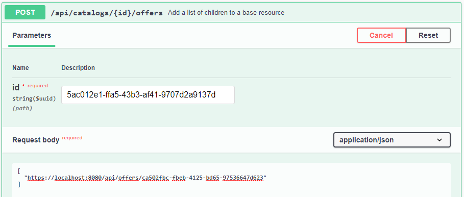
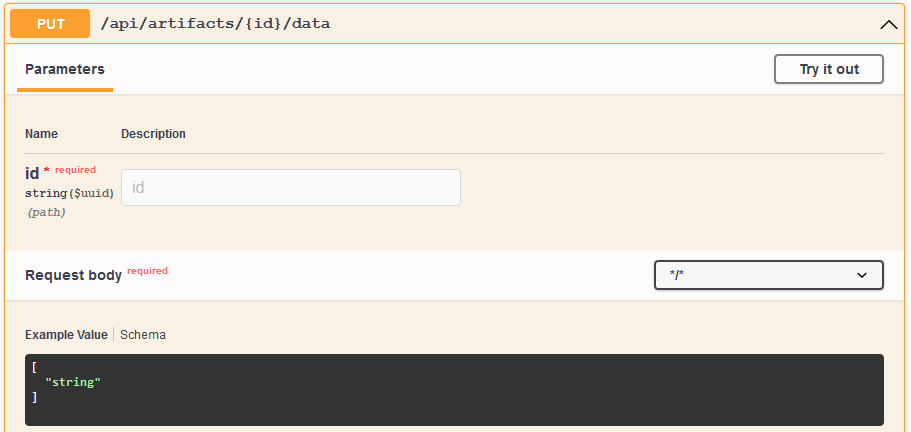
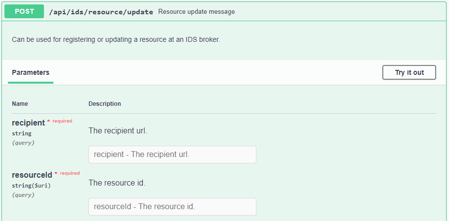

# Providing Data
{: .fs-9 }

See how to provide data with the Dataspace Connector.
{: .fs-6 .fw-300 }

[previous version](../v5/provider.md)

---

The connector provides an endpoint for requesting its self-description.
The self-description is returned as JSON-LD and contains several information about the running
connector instance. This includes e.g. the title, the maintainer, the IDS Informodel version, and
the resource catalog. At the public endpoint `/`, the resource catalog is not displayed. It can only
be accessed with admin credentials at `GET /api/connector` or by sending an IDS description request
message as explained [here](consumer.md#step-1-query-provider---request-a-connectors-self-description).


## Step by Step

To understand the structure of a resource, please first take a look at the
[data model section](../../documentation/v6/data-model.md) and the
[REST API explanation](../../documentation/v6/rest-api.md).
For adding resources to the running connector as a data provider, have a look at the following
steps. How resources can be bootstrapped is explained [here](../../deployment/bootstrapping.md).

In the following example, we want to provide the raw
[data](https://samples.openweathermap.org/data/2.5/weather?lat=35&lon=139&appid=439d4b804bc8187953eb36d2a8c26a02)
to a data consumer.

### Step 1: Register Data Resources

The endpoint `POST /api/offers` can be used for registering a new resource offer at the connector.
This can be done by providing information as metadata in JSON format. An example will be explained
in the following.

```
curl -X 'POST' \
  'https://localhost:8080/api/offers' \
  -H 'accept: */*' \
  -H 'Content-Type: application/json' \
  -d '{
  "title": "Sample Resource",
  "description": "This is an example resource containing weather data.",
  "keywords": [
    "weather",
    "data",
    "sample"
  ],
  "publisher": "https://openweathermap.org/",
  "language": "EN",
  "license": "http://opendatacommons.org/licenses/odbl/1.0/",
  "sovereign": "https://openweathermap.org/",
  "endpointDocumentation": "https://example.com",
  "key": "value"
}'
```

The values `title`, `description`, `keywords`, `publisher`, `sovereign`, `license`, etc. describe
the data resource and will be used to fill in the IDS Information Model attributes for IDS
communication with a connector as data consumer.

---

**Note**: If you need any further attributes, feel free to just type custom key value pairs. They
will be stored as `additional` inside the database - as shown in this example.

---

See the response of the previously registered resource below.

Response headers:

```
cache-control: no-cache,no-store,max-age=0,must-revalidate
 connection: keep-alive
 content-type: application/hal+json
 date: Mon,17 May 2021 17:16:53 GMT
 expires: 0
 keep-alive: timeout=60
 location: https://localhost:8080/api/offers/ca502fbc-fbeb-4125-bd65-97536647d623
 pragma: no-cache
 strict-transport-security: max-age=31536000 ; includeSubDomains
 transfer-encoding: chunked
 x-content-type-options: nosniff
 x-frame-options: DENY
 x-xss-protection: 1; mode=block
```

If the resource was successfully registered, the endpoint will respond with `Http.CREATED` and the
`location`field of the created resource within the response header.

Response body:
```json
{
  "creationDate": "2021-05-17T19:16:53.385+0200",
  "modificationDate": "2021-05-17T19:16:53.385+0200",
  "title": "Sample Resource",
  "description": "This is an example resource containing weather data.",
  "keywords": [
    "weather",
    "data",
    "sample"
  ],
  "publisher": "https://openweathermap.org/",
  "language": "EN",
  "license": "http://opendatacommons.org/licenses/odbl/1.0/",
  "version": 1,
  "sovereign": "https://openweathermap.org/",
  "endpointDocumentation": "https://example.com",
  "additional": {
    "key": "value"
  },
  "_links": {
    "self": {
      "href": "https://localhost:8080/api/offers/ca502fbc-fbeb-4125-bd65-97536647d623"
    },
    "contracts": {
      "href": "https://localhost:8080/api/offers/ca502fbc-fbeb-4125-bd65-97536647d623/contracts{?page,size,sort}",
      "templated": true
    },
    "representations": {
      "href": "https://localhost:8080/api/offers/ca502fbc-fbeb-4125-bd65-97536647d623/representations{?page,size,sort}",
      "templated": true
    },
    "catalogs": {
      "href": "https://localhost:8080/api/offers/ca502fbc-fbeb-4125-bd65-97536647d623/catalogs{?page,size,sort}",
      "templated": true
    },
    "subscriptions": {
      "href": "https://localhost:8080/api/offers/770138f0-3469-4dbd-bb56-8e5edbab987a/subscriptions{?page,size}",
      "templated": true
    },
    "brokers": {
      "href": "https://localhost:8080/api/offers/770138f0-3469-4dbd-bb56-8e5edbab987a/brokers{?page,size}",
      "templated": true
    }
  }
}
```

Apart from the metadata, the response body contains links to further points of interest, such as
itself, its parents, etc. A version number is generated automatically and is increased with every
entity change, as well as the creation and modification date.

The endpoints `PUT`, `GET`, and`DELETE` `/offers/{id}` provide standard CRUD functions to read,
update, and delete the metadata, respectively the data resource - as described
[here](../../documentation/v5/data-model.md).

Next to the resource, we need a catalog as a parent for the offer. Use `POST /api/catalogs` to
create one. Its location is: [https://localhost:8080/api/catalogs/5ac012e1-ffa5-43b3-af41-9707d2a9137d](https://localhost:8080/api/catalogs/5ac012e1-ffa5-43b3-af41-9707d2a9137d).
Then, we need to link both objects to each other via another endpoint. Therefore, we execute a `POST`
catalog's id extended by `/offers` and the resource's id as part of the list in the request body.



```
curl -X 'POST' \
  'https://localhost:8080/api/catalogs/5ac012e1-ffa5-43b3-af41-9707d2a9137d/offers' \
  -H 'accept: */*' \
  -H 'Content-Type: application/json' \
  -d '[
  "https://localhost:8080/api/offers/ca502fbc-fbeb-4125-bd65-97536647d623"
]'
```

As stated [here](../../documentation/v5/data-model.md), **an offered resource is only complete if it
contains at least one contract offer and at least one representation with at least one artifact.
Otherwise, it will not be listed in the IDS self-description because there is no complete data offer.**

Next, create a contract and one rule, that you add to the contract. The rule is the
object, that contains the usage policy as `value`. Since the IDS Usage Control Language is
rather complicated and it is not trivial to manually create a valid policy, endpoints are provided
to obtain example policies (`POST /api/examples/policy`) or to validate created and modified usage
policies (`POST /api/examples/validation`). How these can be used, is explained
[here](../../documentation/v6/usage-control.md#example-endpoint).


By adding multiple rules to one contract offer, you are now able to add multiple usage policies to
one resource (e.g. the data usage can be logged and the data should be deleted at a given date).

### Step 2: Add Local Data

After we created a contract offer and a resource offer and added the latter to a catalog, we
have to create a representation and add it to the resource offer. Then, we have to create an
artifact and add it to the representation.

Within the artifact, you can specify whether you want to provide local data or remote data from an
external API (see [Step 3](#step-3-add-remote-data)). For local data, you would have to add the
following body to your `POST` request:

```json
{
  "value": "Hello World"
}
```

Response body:

````json
{
  "creationDate": "2021-05-17T19:40:37.375+0200",
  "modificationDate": "2021-05-17T19:40:37.375+0200",
  "remoteId": "genesis",
  "title": "",
  "numAccessed": 0,
  "byteSize": 32,
  "checkSum": 3110206735,
  "additional": {},
  "_links": {
    "self": {
      "href": "https://localhost:8080/api/artifacts/911a0451-f93f-4850-9dc7-e1a70060b2d1"
    },
    "data": {
      "href": "https://localhost:8080/api/artifacts/911a0451-f93f-4850-9dc7-e1a70060b2d1/data"
    },
    "representations": {
      "href": "https://localhost:8080/api/artifacts/911a0451-f93f-4850-9dc7-e1a70060b2d1/representations{?page,size,sort}",
      "templated": true
    },
    "agreements": {
      "href": "https://localhost:8080/api/artifacts/911a0451-f93f-4850-9dc7-e1a70060b2d1/agreements{?page,size,sort}",
      "templated": true
    },
    "subscriptions": {
      "href": "https://localhost:8080/api/artifacts/874df41f-babc-47a8-b926-095a10ef7f4b/subscriptions{?page,size}",
      "templated": true
    }
  }
}
````

In this case, the data will be stored within and loaded from the internal database.

Another endpoint is provided to add data via PUT request.



---

**Note**: The Dataspace Connector automatically calculates the bytesize and checksum for local data.

---

### Step 3: Add Remote Data

For remote data, as in this example, it is possible to set the attributes `accessUrl`, `username`,
and `password` to define details for the data providing connector on how to retrieve the data from
connected backend systems or existing APIs. You do not need to specify whether you added remote or
local data. The Dataspace Connector automatically classifies an artifact as `remote` as soon as the
`accessUrl` property is filled.

```json
{
  "accessUrl": "https://samples.openweathermap.org/data/2.5/weather?lat=35&lon=139&appid=439d4b804bc8187953eb36d2a8c26a02"
}
```

Currently, the Dataspace Connector can natively establish a connection via http, https, and https
with basicAuth or apiKey. To use one of the authentications, just add the appropriate object to the
body of your request. To connect to other backends, take a look at how to integrate routing
frameworks as explained [here](../../deployment/camel.md).

---

**Note**: While the connector has the ability to store data internally, it never duplicates data
connected by external systems into its internal memory. Instead, the data is only forwarded when a
request is received. In addition, the backend connection credentials are never passed on to another
connector, but are only used for internal data handling.

---

In case an external REST API should be connected and this API usually expects query parameters from
the user, e.g. to retrieve the raw data in various formats, multiple artifacts can be created
for one representation, or multiple artifacts with one representation each. Each artifact can then
refer to one specified http request or database query with fix parameters.

If you want to leave it up to the consumer which part of the data should be retrieved, a reference
to the OpenApi description of the connected REST Api as `endpointDocumentation` may be provided.
This is useful, for example, if the connected API is a generic Linked Data Platform. The consumer
can then pass request parameters when retrieving data, which are automatically resolved at the
Dataspace Connector to the provider backend.

### Step 4: Publish Resources at an IDS Broker (optional)

For communicating with an IDS metadata broker, some endpoints are provided. For a detailed
description, see [here](ecosystem.md).

## Policy Enforcement

When the data provider receives an `ArtifactRequestMessage` from an external connector, the
`ArtifactMessageHandler` iterates through all contracts of a resource offer and all of its rules
to check the policy pattern. If the pattern matches one of the following five, an appropriate policy
check is performed:`PROVIDE_ACCESS`, `PROHIBIT_ACCESS`, `USAGE_DURING_INTERVAL`,
`USAGE_UNTIL_DELETION`, `CONNECTOR_RESTRICTED_USAGE`, and `SECURITY_PROFILE_RESTRICTED_USAGE`.

Depending on the specified rules, the access permission will be set to true or false. If it is true,
the data provider returns the data. If not, it will respond with a `RejectionReason.NOT_AUTHORIZED`.

---

**Note**: The contract negotiation is enabled by default. To disable it, have a look at the
[configurations](../../deployment/configuration.md#ids-settings).

---

## Resource Updates

If your setup or use case does not covers a consumer subscribing to a resource offer, you can
trigger the sending of `ResourceUpdateMessages` manually by using the respective endpoint.



How subscriptions can be used, is described [here](subscription.md).
